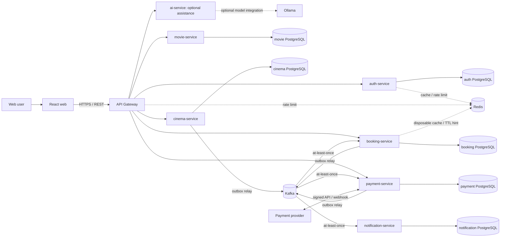

# System Architecture

Status: Phase 0 baseline  
Last updated: 2026-10-03 (AI extension in ADR-011; simple Java packages in ADR-012; manual schema management in ADR-013)

## Goals

The platform favors booking correctness, payment correctness, local transactional consistency, idempotency, explicit ownership, security, and operability over throughput or visual effects. ADR-011 extends the initial boundary set with optional AI assistance independent of booking/payment correctness.

## Overall system architecture

Every database arrow terminates at its owning service. Sharing a PostgreSQL cluster during local development does not permit shared schemas, credentials, queries, or cross-database joins. Managed database updates are applied manually, with reference SQL in each service; startup validates mappings without executing DDL. See [ADR-013](ADR/ADR-013-manual-database-schema-management.md).

## Deployable responsibilities

Java code within each deployable uses concrete responsibility packages such as `entity`, `repository`, `dto`, `exception`, `config`, and `filter`; future endpoint/business classes belong in `controller` and `service`. Packages are created only when populated. See [ADR-012](ADR/ADR-012-simple-service-package-structure.md). This internal organization does not change service data ownership or distributed workflows.

- **frontend/** renders the customer journey. It never decides authoritative seat or payment state.
- **api-gateway** is the public edge for routing, authentication enforcement, rate limiting, request sizing, and correlation IDs. It has no domain database and coordinates no Saga.
- **auth-service** owns identity, credentials, tokens/sessions, roles, and account security.
- **movie-service** owns movie catalog metadata.
- **cinema-service** owns cinemas, auditoriums, physical seat definitions, and showtime schedules.
- **booking-service** owns replicated showtime-seat inventory for booking, reservations, booking records, ticket entitlement, hold expiry, and the durable booking/payment Saga state.
- **payment-service** owns payment attempts, provider adapters, verified callbacks, provider transaction references, reconciliation, and refunds.
- **notification-service** owns notification preferences, templates, delivery attempts, and delivery results. It reacts to events; notification failure never rolls back a booking.

Detailed ownership is in [service-boundaries.md](service-boundaries.md).

`ai-service` owns optional assistance and model integration. Initially it is a fail-closed Spring AI skeleton with no business API, database, or events. Model output cannot establish booking/payment state; core flows work with AI disabled or unavailable. See [ADR-011](ADR/ADR-011-optional-ai-service.md).

## Communication rules

REST is used where the caller needs an immediate answer, such as queries, authentication, reservation submission, or status lookup. Calls have explicit timeouts and must not form an unjustified synchronous chain. Kafka carries asynchronous domain facts and Saga requests/results.

Critical producers use a Transactional Outbox. Outbox relays may publish duplicates after a crash. Consumers therefore store an inbox/processed-event key in the same transaction as their local effects, then acknowledge the Kafka offset only after commit.

Events are keyed by the stable aggregate ID when ordering matters. Ordering is not assumed across aggregates or topics. Contract evolution is backward-compatible and explicitly versioned.

## Distributed consistency

There is no cross-service transaction. `booking-service` coordinates the booking/payment Saga through durable local state and events:

1. It atomically holds seats and records reservation events.
2. It atomically moves a valid hold to `PAYMENT_PENDING` and records `PaymentRequested`.
3. `payment-service` creates/updates its local attempt and emits a verified result.
4. `booking-service` either sells the still-valid seats and confirms the booking, or releases them.
5. A payment success that arrives after release cannot reclaim seats; it causes an idempotent refund request.

Redis is never on this correctness path. See [booking-flow.md](booking-flow.md), [concurrency.md](concurrency.md), and [payment-flow.md](payment-flow.md).

## Security and observability

- The gateway authenticates external requests; each service authorizes commands over its own resources.
- Secrets and provider credentials come from environment/secret management and are never committed or logged.
- Services generate or propagate `traceId` and use structured logs with safe identifiers such as reservation, booking, payment, and showtime IDs.
- Health, readiness, metrics, logs, Kafka lag, outbox backlog, payment discrepancies, expiry backlog, and database contention will be observable.
- Sensitive payloads, JWTs, passwords, payment credentials, and webhook secrets are excluded from logs and events.

## Phase 0 non-goals

- Spring Boot or React implementation
- Real provider integration
- Production infrastructure sizing
- Final topic partition counts, hold duration, retention, or SLO values
- Cross-region consistency or multi-cluster disaster-recovery design
