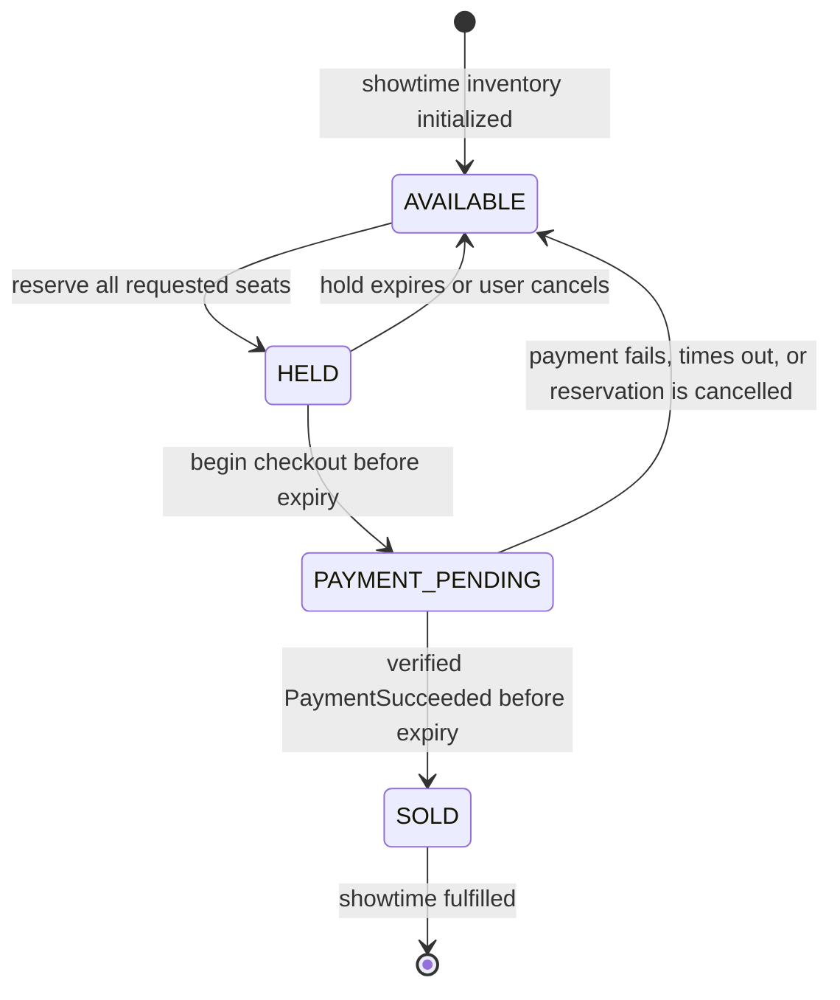

# Booking Flow

Status: Phase 0 behavioral design

## Owned aggregates

`booking-service` owns:

- a local bookable snapshot for each published showtime, including seat and price identifiers supplied by `cinema-service`;
- one `showtime_seats` row for every bookable `(showtime_id, seat_id)`;
- reservations and their requested seat set;
- pending/confirmed/cancelled bookings and ticket entitlement;
- the durable booking/payment Saga state;
- reservation-command idempotency, inbox deduplication, and outbox events.

Cinema seat definitions and schedules remain owned by `cinema-service`. Once a showtime is published, booking uses its local immutable identifiers/price snapshot for transactional work; it never queries the cinema database.

## Seat reservation state machine



Every arrow is an explicit booking-domain operation executed under a local PostgreSQL transaction. Direct controller/listener state assignment is prohibited. Refund or post-sale cancellation policy is not represented as `SOLD -> AVAILABLE`; resale rules require a future decision and ADR.

## Successful booking sequence

```mermaid
sequenceDiagram
    autonumber
    actor User
    participant Web as React web
    participant GW as API Gateway
    participant B as booking-service
    participant BDB as booking PostgreSQL
    participant K as Kafka
    participant P as payment-service
    participant PDB as payment PostgreSQL
    participant PSP as Payment provider

    User->>Web: Select showtime and seats
    Web->>GW: POST /api/v1/reservations (Idempotency-Key)
    GW->>B: Authenticated reservation command + traceId
    B->>BDB: BEGIN; claim key; lock seats in canonical order
    B->>BDB: Validate all AVAILABLE; write HELD + reservation + outbox
    BDB-->>B: COMMIT
    B-->>GW: 201 reservation + holdExpiresAt
    GW-->>Web: 201 reservation + holdExpiresAt

    Web->>GW: POST /api/v1/reservations/{id}/checkout (Idempotency-Key)
    GW->>B: Authenticated checkout command
    B->>BDB: BEGIN; lock reservation then sorted seats
    B->>BDB: HELD -> PAYMENT_PENDING; create pending booking + PaymentRequested outbox
    BDB-->>B: COMMIT
    B-->>GW: 202 booking/payment pending
    GW-->>Web: 202 booking/payment pending

    B->>K: Outbox relay publishes PaymentRequested
    K->>P: At-least-once delivery
    P->>PDB: Idempotently create payment/attempt
    P->>PSP: Create checkout with stable provider identity
    PSP-->>P: Checkout instruction
    P->>PDB: Persist provider-pending state/instruction
    Web->>GW: GET /api/v1/payments/{paymentId}
    GW->>P: Authorized payment status query
    P-->>GW: Requested/provider-pending status
    GW-->>Web: Checkout instruction when ready
    User->>PSP: Complete provider-hosted flow
    PSP->>P: Signed server webhook
    P->>PDB: Verify callback; persist SUCCEEDED + outbox
    P->>K: Outbox relay publishes PaymentSucceeded
    K->>B: At-least-once delivery
    B->>BDB: Inbox + lock aggregate/seats; PAYMENT_PENDING -> SOLD; outbox
    BDB-->>B: COMMIT
    B->>K: Publish BookingConfirmed
    Web->>GW: GET /api/v1/bookings/{bookingId}
    GW->>B: Query
    B-->>GW: Confirmed booking/ticket entitlement
    GW-->>Web: Confirmed booking/ticket entitlement
```

The diagram abbreviates outbox and inbox internals; every critical publish follows the Transactional Outbox rules in [event-catalog.md](event-catalog.md).

## Reserve seats command

Input includes authenticated actor, `showtimeId`, a non-empty unique seat set, and `Idempotency-Key`. The server computes a canonical request hash after normalization.

Within one transaction:

1. Claim or resolve the scoped idempotency record. Same key and hash returns the original outcome; same key with another hash is a conflict.
2. Lock all requested rows in canonical seat order with `SELECT ... FOR UPDATE`.
3. Require the exact row count and `AVAILABLE` state for every requested seat.
4. Create the reservation with a configurable database-time deadline.
5. Change every row to `HELD` with `held_by`, `reservation_id`, and `hold_expires_at`.
6. Persist the stable response/outcome and `ReservationCreated` plus `SeatsHeld` outbox records.
7. Commit and only then return/publish.

Any missing or unavailable seat rejects the whole set with `409 SEAT_UNAVAILABLE`; no partial reservation survives.

## Begin checkout

The actor must own the reservation. One transaction locks the reservation/Saga row and then its seats in canonical order, verifies `HELD` and `hold_expires_at > database_now`, freezes the amount/currency and price snapshot, creates a pending booking, changes seats to `PAYMENT_PENDING`, and writes `PaymentRequested` to the outbox. A repeated checkout idempotency key returns the same pending booking/payment reference.

The original deadline remains attached to `PAYMENT_PENDING` unless a separately documented bounded extension policy is introduced. Phase 0 does not authorize extension merely because a user opened a provider page.

## Payment result handling

On `PaymentSucceeded`, one transaction stores the consumer inbox key, locks the booking/reservation aggregate and seats, and revalidates the expected payment ID, amount, currency, state, and deadline.

- If valid and unexpired, it moves all seats to `SOLD`, confirms reservation/booking, and writes `BookingConfirmed` to the outbox.
- If already confirmed for that payment, it is an idempotent no-op.
- If expired, released, cancelled, mismatched, or otherwise unable to confirm, it does not reclaim seats. It records compensation state and writes one `RefundRequested` event.

On `PaymentFailed`, the equivalent transaction releases still-owned `PAYMENT_PENDING` seats, cancels the pending booking, and writes `BookingCancelled` plus `ReservationReleased`. Duplicate or stale failure after confirmation cannot undo `SOLD`.

## Expiration and cancellation

Workers claim expired aggregates in bounded batches using PostgreSQL locks and `SKIP LOCKED`. They re-check the deadline and state under lock, lock seats in canonical order, release only rows still owned by that reservation, update aggregate state, and write `SeatHoldExpired`/`ReservationReleased` in the same transaction. Multiple workers and repeated runs are safe.

User cancellation follows the same aggregate-then-seat lock order and ownership checks. Cancellation during an ambiguous provider operation must coordinate through Saga state; it cannot assume money was not captured.

## Core invariants

- A `(showtime_id, seat_id)` has at most one current owner and at most one successful booking.
- A multi-seat reservation is entirely held/sold or entirely rejected/released for a single transition.
- A booking is confirmed only from a verified, matching, idempotently consumed payment success.
- Expired/released seats are never resurrected by a late event.
- State mutation, request/event deduplication, and resulting outbox records commit atomically.
- No network call occurs while PostgreSQL seat locks are held.
