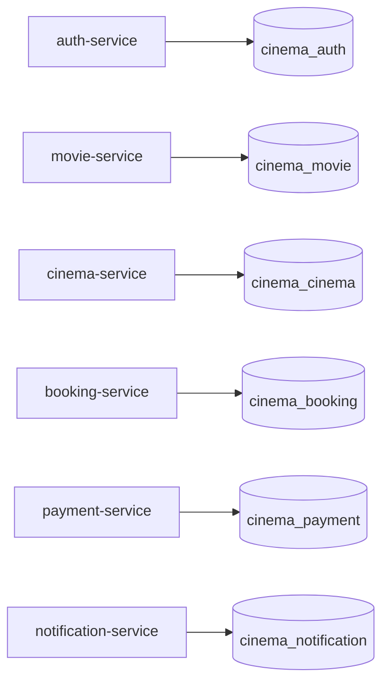

# Implemented database schema

## Database Overview

As of the current repository state, the implemented **application schema is empty**. Each of the six stateful services has its own PostgreSQL database, Flyway configuration, and comment-only `V1__baseline.sql` migration. There are no JPA entities or other ORM mappings. The gateway has no database. This diagram reflects the repository's migrations and mappings; it does not claim to inventory a running database or Flyway's runtime-managed schema history.

| Service domain | Configured database | Implemented application tables |
|---|---|---:|
| Authentication | `cinema_auth` | 0 |
| Movie catalog | `cinema_movie` | 0 |
| Cinema and showtimes | `cinema_cinema` | 0 |
| Booking and seat inventory | `cinema_booking` | 0 |
| Payment and refunds | `cinema_payment` | 0 |
| Notifications | `cinema_notification` | 0 |

### Physical ER diagram

There are no implemented application entities or relationships to draw. The empty ER diagram is intentional; adding conceptual tables here would misstate the physical schema.

```mermaid
erDiagram
    %% No application tables or foreign-key relationships are implemented.
```

The following is a **database ownership map**, not an ER diagram. Its arrows identify configured service-to-database ownership, not table relationships.



## Important Relationships

There are no implemented primary keys, foreign keys, unique constraints, junction tables, or physical one-to-one, one-to-many, or many-to-many relationships. The services are designed to exchange identifiers through APIs and events, but no application-level relationship is implemented in persistence yet. No cross-service foreign key should be inferred from the planned `user_id`, `movie_id`, or `showtime_id` references in [database-design.md](../database-design.md).

## Design Notes

- All six services configure Flyway migrations at `classpath:db/migration` and Hibernate `ddl-auto: validate`; each currently has only a comment-only V1 baseline.
- Separate JDBC URLs and users are configured for the six databases. The local [Compose file](../../docker-compose.yml) defines a distinct PostgreSQL container and volume for each.
- No application columns, nullable fields, indexes, status types, cascade rules, soft-delete markers, audit fields, optimistic-lock versions, or concurrency fields are implemented. No application transaction or outbox table is represented in the current schema.
- The proposed booking `showtime_seats` structure and other tables in [database-design.md](../database-design.md) are a logical design for later migrations, not present-day tables. The importable [DBML](schema.dbml) intentionally contains no `Table` or `Ref` declarations.

## Schema Discrepancies

The Phase 0 [database design](../database-design.md) describes a conceptual `showtime_seats` table and expected auth, catalog, cinema, booking, payment, notification, outbox, and inbox tables. None appears in the six current Flyway baselines or JPA mappings. This is a planned-versus-implemented gap, consistent with [project-status.md](../project-status.md) placing core domain services in progress; it is not evidence that a migration is missing from an implemented feature.

When a service adds its first domain migration, update these diagrams from that migration and its mappings. Keep each database separate, and label any cross-service identifier as a logical reference rather than a foreign key.
