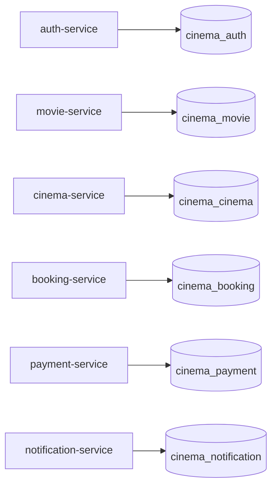
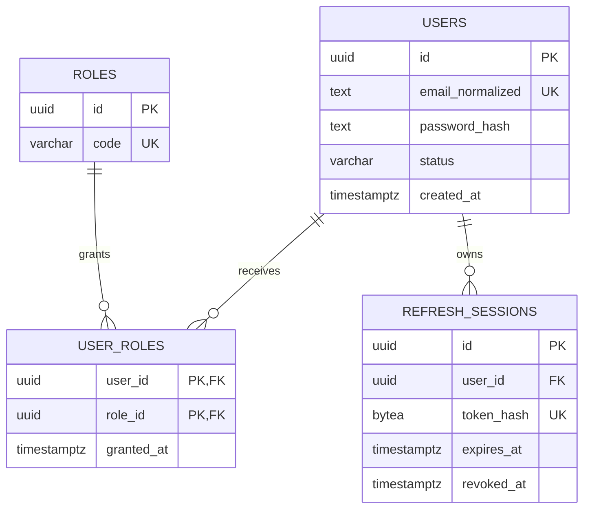
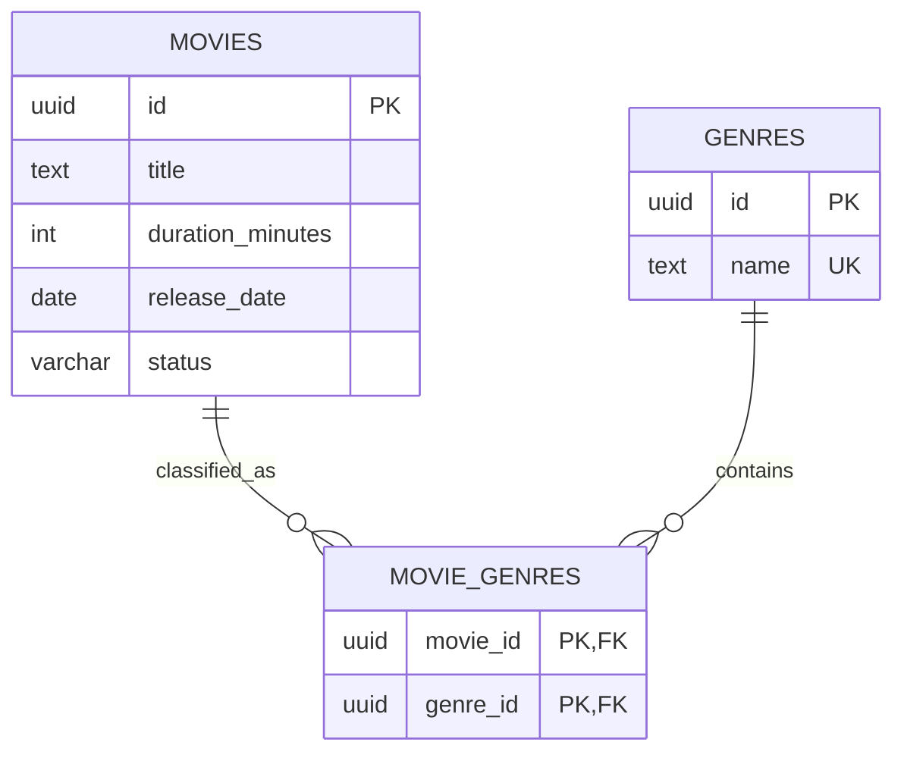
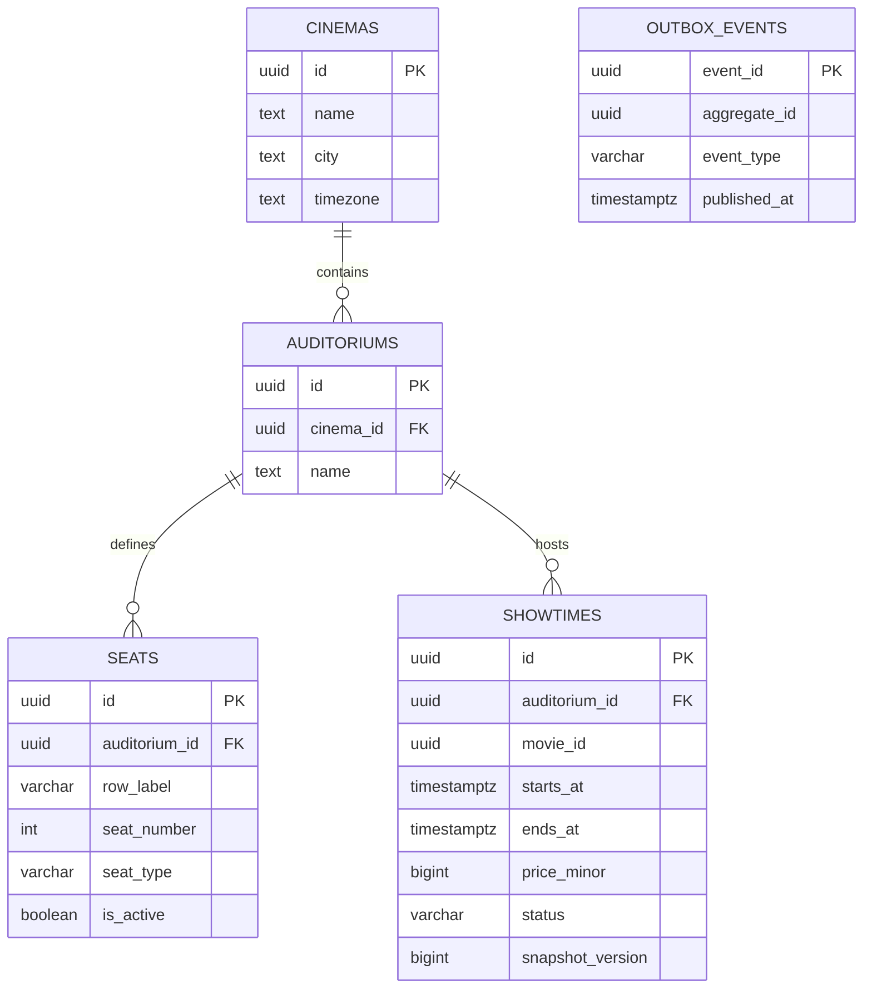
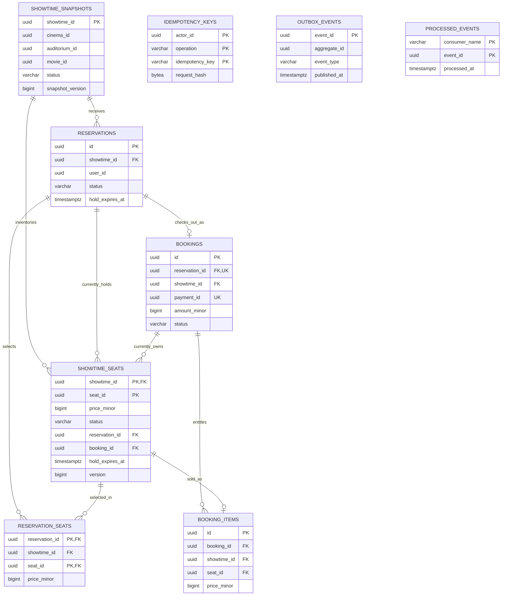
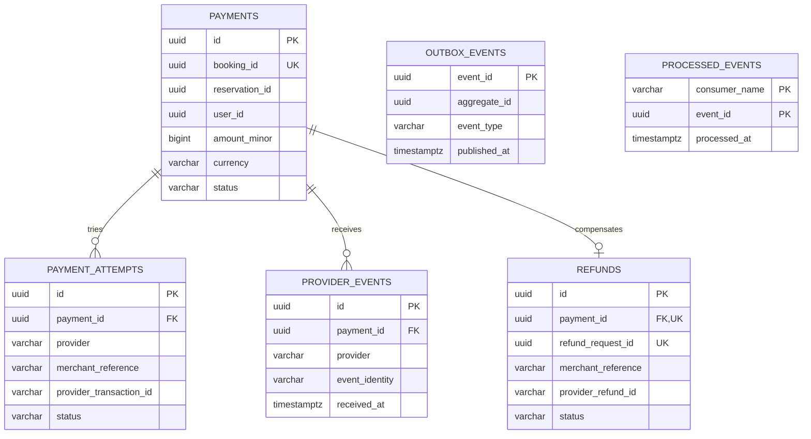
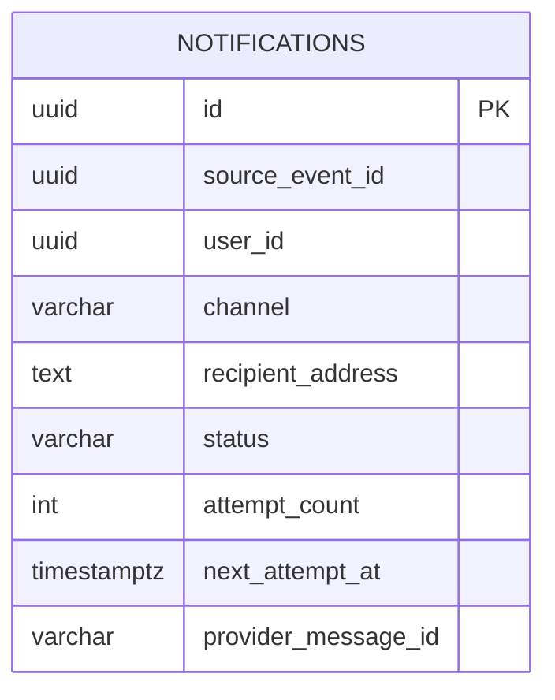

# Database diagrams

The tables below are implemented by each service's V2 Flyway migration. [DBML](schema.dbml) lists columns and relationships; [database design](../database-design.md) explains PostgreSQL-specific checks and future application transitions. DBML's six namespaces represent six **separate databases**. The business workflows are not implemented yet.

## System-level ownership

Arrows here mean service ownership of a database, **not** foreign keys. The gateway has no database.

## Authentication database

## Movie catalog database

## Cinema and showtime database

`SEATS` describes permanent auditorium positions. Live availability is held by booking, not here. `SHOWTIMES.movie_id` is a logical movie-service ID without a database FK.

`OUTBOX_EVENTS` is intentionally unconnected: its `aggregate_id` is an event key, not a physical FK to one table.

## Booking database

`SHOWTIME_SNAPSHOTS` and `SHOWTIME_SEATS` contain copied cinema identifiers without cross-database FKs. `SHOWTIME_SEATS` is the sole authoritative availability table. `BOOKING_ITEMS` is created only when a booking confirms; its unique `(showtime_id, seat_id)` prevents a second successful sale.

The reservation/booking-to-seat references use composite local FKs with `showtime_id`; the Mermaid lines simplify those composite keys for readability. `IDEMPOTENCY_KEYS.actor_id`, `BOOKINGS.payment_id`, and the inbox/outbox event IDs are not physical FKs to other databases or arbitrary aggregates.

## Payment database

Booking, reservation, and user IDs are logical references. Provider transaction, event, merchant, and refund identifiers are local unique identities; no raw card data is modeled.

## Notification database

One notification row is both the durable event deduplication record and the delivery job. `source_event_id` and `user_id` are logical IDs, not local FKs. Its unique `(source_event_id, channel)` prevents duplicate jobs for the same delivery channel.

## Relationship and implementation boundary

Every ER relationship above corresponds to an implemented **local** DBML `Ref`. Cross-service IDs appear as plain attributes and will be resolved through APIs or events when those workflows are implemented. The V2 migrations are authoritative if a diagram ever differs from the database.
