# Kafka Event Catalog

Status: Phase 0 contract baseline

## Delivery contract

Kafka provides at-least-once delivery for this platform. Producer retries, relay crashes, consumer restarts, and offset-commit failures can all create duplicates. Event handlers must be durably idempotent; no service may depend on exactly-once delivery for business correctness.

Ordering is guaranteed only within a Kafka partition. Events that require per-aggregate order use `aggregateId` as the message key. Consumers still validate current state because events can arrive late, be replayed, or originate on different topics.

## Standard envelope

Every event uses this logical envelope:

```json
{
  "eventId": "uuid",
  "eventType": "PaymentSucceeded",
  "eventVersion": 1,
  "aggregateId": "uuid",
  "occurredAt": "2026-09-24T12:34:56.789Z",
  "traceId": "opaque-correlation-id",
  "payload": {}
}
```

- `eventId` identifies one immutable outbox record. Republishing that row preserves the ID.
- `eventType` is the stable semantic name; `eventVersion` is a positive integer schema version.
- `aggregateId` is the Kafka key when aggregate order matters.
- `occurredAt` is the UTC instant the owning transaction recorded the fact/request, not relay publish time.
- `traceId` propagates the initiating trace where available.
- `payload` contains the minimum non-secret data required by documented consumers. Credentials, JWTs, provider secrets, and raw sensitive payloads are prohibited.

## Topic strategy

Initial logical topics group events by owning bounded context:

- `cinema.showtime-events.v1`
- `cinema.booking-events.v1`
- `cinema.payment-events.v1`

The `.v1` suffix versions topic-level compatibility, not every event payload. Final partition counts, retention, replication, ACLs, and dead-letter/quarantine destinations are Phase 1 environment decisions. Producers may write only their owned topic; consumers receive least-privilege read access.

## Event catalog

| Event v1 | Producer | Required consumer(s) | `aggregateId` / key | Trigger and idempotent meaning |
|---|---|---|---|---|
| `ShowtimePublished` | cinema-service | booking-service | `showtimeId` | A publish transaction commits the immutable bookable showtime/seat/price snapshot version. Repetition creates no duplicate inventory rows. |
| `ShowtimeCancelled` | cinema-service | booking-service | `showtimeId` | Cinema cancels a schedule. Booking applies the version once; customer compensation policy is still open. |
| `ReservationCreated` | booking-service | notification-service if hold notices enabled | `reservationId` | A reservation aggregate and complete seat set were held. Same event never creates another reservation. |
| `SeatsHeld` | booking-service | No mandatory Phase 0 consumer | `reservationId` | The listed showtime seats atomically entered `HELD` for this reservation. It does not grant authority to mutate booking state elsewhere. |
| `SeatHoldExpired` | booking-service | notification-service | `reservationId` | The deadline won and the reservation no longer owns the listed seats. Duplicate notice has no additional effect. |
| `ReservationReleased` | booking-service | No mandatory Phase 0 consumer | `reservationId` | Held/payment-pending seats were transactionally released for the stated reason. |
| `PaymentRequested` | booking-service | payment-service | `paymentId` | A valid booking Saga requests one payment for the immutable amount/currency. Same ID/key means the same request. |
| `PaymentSucceeded` | payment-service | booking-service | `paymentId` | A verified matching provider result made payment successful. It does not itself guarantee a still-valid seat hold. |
| `PaymentFailed` | payment-service | booking-service | `paymentId` | A definitive payment failure occurred. Ambiguous outcomes are reconciled before this event. |
| `BookingConfirmed` | booking-service | notification-service | `bookingId` | Matching payment and unexpired seat ownership were atomically confirmed/sold. |
| `BookingCancelled` | booking-service | notification-service | `bookingId` | A pending booking was cancelled for the stated reason; duplicate notifications deduplicate by event ID. |
| `RefundRequested` | booking-service | payment-service | `paymentId` | Saga compensation requests one refund for a successful payment that cannot be fulfilled. |
| `RefundCompleted` | payment-service | booking-service, notification-service | `paymentId` | The provider-authoritative refund completed for the stated amount/reference. |
| `RefundFailed` | payment-service | booking-service | `paymentId` | Refund needs safe retry or manual reconciliation; it must not be reported as completed. |

## Minimum payload semantics

All fields below are inside `payload`; the standard envelope remains mandatory.

| Event | Required payload fields for v1 |
|---|---|
| `ShowtimePublished` | `showtimeId`, `cinemaId`, `auditoriumId`, `movieId`, `startsAt`, `salesCloseAt`, `currency`, `seats[]` with stable `seatId`, label/type and price minor units, `snapshotVersion` |
| `ShowtimeCancelled` | `showtimeId`, `snapshotVersion`, `reasonCode`, `cancelledAt` |
| `ReservationCreated` | `reservationId`, `userId`, `showtimeId`, `seatIds[]`, `holdExpiresAt` |
| `SeatsHeld` | `reservationId`, `showtimeId`, `seatIds[]`, `holdExpiresAt` |
| `SeatHoldExpired` | `reservationId`, `userId`, `showtimeId`, `seatIds[]`, `expiredAt` |
| `ReservationReleased` | `reservationId`, `bookingId` when present, `showtimeId`, `seatIds[]`, `reasonCode`, `releasedAt` |
| `PaymentRequested` | `paymentId`, `bookingId`, `reservationId`, `userId`, `amountMinor`, `currency`, `idempotencyKey`, `requestedAt` |
| `PaymentSucceeded` | `paymentId`, `bookingId`, `reservationId`, `amountMinor`, `currency`, `provider`, `providerTransactionId`, `succeededAt` |
| `PaymentFailed` | `paymentId`, `bookingId`, `reservationId`, `provider`, `failureCode`, `failedAt` |
| `BookingConfirmed` | `bookingId`, `reservationId`, `paymentId`, `userId`, `showtimeId`, `seatIds[]`, `confirmedAt` |
| `BookingCancelled` | `bookingId`, `reservationId`, `paymentId` when present, `userId`, `showtimeId`, `seatIds[]`, `reasonCode`, `cancelledAt` |
| `RefundRequested` | `refundRequestId`, `paymentId`, `bookingId`, `userId`, `amountMinor`, `currency`, `reasonCode`, `idempotencyKey` |
| `RefundCompleted` | `refundId`, `refundRequestId`, `paymentId`, `bookingId`, `userId`, `amountMinor`, `currency`, `providerRefundId`, `refundedAt` |
| `RefundFailed` | `refundId`, `refundRequestId`, `paymentId`, `failureCode`, `failedAt`, `retryable` |

Arrays representing a seat set are emitted in canonical seat order for deterministic payload hashing and diagnostics. Events contain stable internal identifiers rather than copied credentials or unnecessary personal data.

## Transactional Outbox

For every critical event, the owner writes its business change and immutable outbox row in the same local PostgreSQL transaction. A relay:

1. claims a bounded set of unpublished rows, using safe multi-worker coordination such as `FOR UPDATE SKIP LOCKED`;
2. publishes the stored envelope using `aggregateId` as key;
3. waits for the broker acknowledgement;
4. records publication metadata;
5. retries with backoff and exposes backlog/age/failure metrics.

The relay never constructs a new semantic event or new `eventId` for a retry. A crash after broker acknowledgement but before the local published mark yields a duplicate, which is expected.

## Idempotent consumers (inbox pattern)

A state-changing consumer transaction first inserts unique `(consumer_name, event_id)`, then applies the legal local transition and any derived outbox records. It commits before acknowledging the Kafka offset. Duplicate insert conflict means the effect already committed and can be acknowledged without repeating it.

An inbox record alone does not make external calls idempotent. Provider and notification operations also need stable downstream idempotency/provider references and durable attempt state.

Permanent validation/schema failures go to a controlled quarantine/dead-letter process after bounded retries, with alerts and non-sensitive diagnostics. Business-stale events normally become an audited no-op or explicit compensation rather than blocking a partition forever.

## Kafka event flow

```mermaid
flowchart LR
    CDB[(cinema DB)] --> CO[cinema outbox]
    BDB[(booking DB)] --> BO[booking outbox]
    PDB[(payment DB)] --> PO[payment outbox]

    CO --> CR[cinema relay]
    BO --> BR[booking relay]
    PO --> PR[payment relay]

    CR --> ST[showtime-events.v1]
    BR --> BT[booking-events.v1]
    PR --> PT[payment-events.v1]

    ST --> BI[booking inbox]
    BT --> PI[payment inbox]
    BT --> NI[notification inbox]
    PT --> BI
    PT --> NI

    BI --> BDB
    PI --> PDB
    NI --> NDB[(notification DB)]

    BDB -. derived event in same transaction .-> BO
    PDB -. derived event in same transaction .-> PO
```



## Saga event paths

Happy path:

`ReservationCreated`/`SeatsHeld` -> `PaymentRequested` -> `PaymentSucceeded` -> `BookingConfirmed`

Definitive payment failure:

`PaymentRequested` -> `PaymentFailed` -> `BookingCancelled` + `ReservationReleased`

Late success or other fulfilment failure:

`PaymentSucceeded` -> `RefundRequested` -> `RefundCompleted` (or visible `RefundFailed` reconciliation state)

Seat hold timeout before successful fulfilment:

`SeatHoldExpired` + `ReservationReleased`; any later `PaymentSucceeded` follows the refund path and never resurrects seats.
