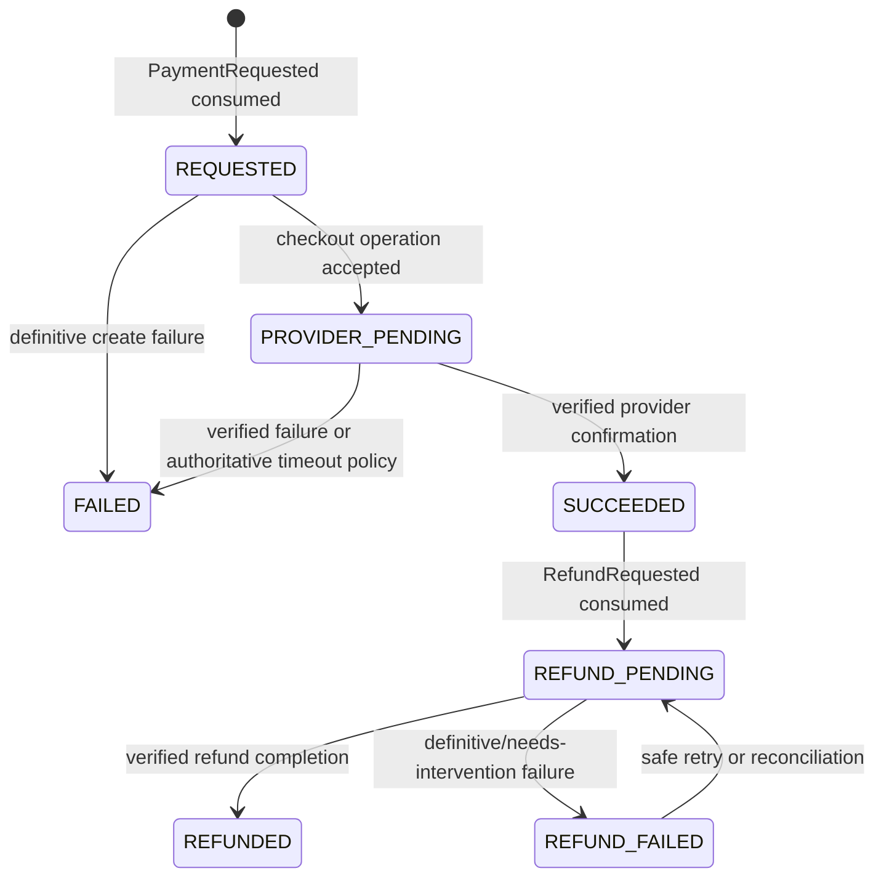

# Payment Architecture and Flow

Status: Phase 0 behavioral design; no real provider integration

## Ownership and provider abstraction

Only `payment-service` communicates with payment providers. A provider adapter will expose capabilities such as creating a checkout, verifying/parsing a webhook, querying an ambiguous transaction, and requesting/querying a refund. Domain/application code depends on this internal abstraction, not VNPay, MoMo, ZaloPay, or Stripe types.

Provider capabilities differ. Each future adapter must document supported idempotency, signature verification, status-query, refund, timeout, and reconciliation semantics before activation. Phase 0 uses no live adapter or credentials.

## Payment state machine



Timeout or network error is not automatically `FAILED`: an ambiguous provider outcome is reconciled using the stable provider idempotency/merchant reference and authoritative query. A terminal result is never overwritten blindly by a later contradictory callback.

## Payment sequence

```mermaid
sequenceDiagram
    autonumber
    actor User
    participant Web as React web
    participant GW as API Gateway
    participant B as booking-service
    participant BDB as booking PostgreSQL
    participant K as Kafka
    participant P as payment-service
    participant PDB as payment PostgreSQL
    participant PSP as Payment provider

    Web->>GW: Begin checkout (Idempotency-Key)
    GW->>B: Authorized checkout command + traceId
    B->>BDB: Lock hold; PAYMENT_PENDING + pending booking + outbox
    BDB-->>B: Commit
    B-->>GW: 202 pending payment reference
    GW-->>Web: 202 pending payment reference
    B->>K: Publish PaymentRequested from outbox
    K->>P: Deliver PaymentRequested (may repeat)
    P->>PDB: Inbox + payment/attempt REQUESTED
    PDB-->>P: Commit
    P->>PSP: Create checkout with stable provider idempotency/reference
    PSP-->>P: Provider checkout/transaction reference
    P->>PDB: Persist PROVIDER_PENDING + checkout instruction
    Web->>GW: Query payment/checkout status
    GW->>P: Authorized payment status query
    P-->>GW: Provider redirect/deep-link instruction
    GW-->>Web: Provider redirect/deep-link instruction
    User->>PSP: Authorize payment
    PSP-->>Web: Browser redirect (informational only)
    PSP->>P: Signed server webhook (may repeat/reorder)
    P->>P: Verify signature, merchant, amount, currency, reference
    P->>PDB: Provider-event inbox + SUCCEEDED + outbox in one transaction
    P-->>PSP: 2xx acknowledgement
    P->>K: Publish PaymentSucceeded from outbox
    K->>B: Deliver result (may repeat)
    B->>BDB: Inbox + lock Saga/seats; confirm or request refund
    BDB-->>B: Commit
```

The frontend redirect only prompts a status refresh. It never sets `SUCCEEDED`, confirms a booking, or creates a ticket.

## Payment request idempotency

`PaymentRequested` contains a stable `paymentId`, booking/reservation IDs, amount in minor units, currency, and request idempotency key derived from the checkout intent. `payment-service` uses unique constraints on its consumer inbox and scoped idempotency key/request hash so duplicate events converge on the same payment/attempt.

Provider create/refund calls use a stable merchant reference and provider idempotency key whenever supported. An external timeout is resolved by repeating only a provider-documented safe call or querying by that stable reference; it is not retried with a new identity.

## Webhook handling

For every webhook:

1. Preserve the raw bytes only as required to verify the signature; do not log them.
2. Identify the configured provider/account and verify signature, timestamp/replay controls, merchant reference, amount, and currency.
3. Begin a local transaction and insert unique `(provider, provider_event_id)` metadata or an approved stable digest when the provider lacks an event ID.
4. Lock the payment, validate the legal expected transition, persist the provider transaction reference and result, and insert the corresponding outbox event.
5. Commit, then acknowledge with the provider-required success response.

A known duplicate returns the provider-required successful acknowledgement without repeating state changes or events. Invalid signatures receive no business transition and follow provider-specific response/security policy. Contradictory terminal events are recorded for reconciliation/alerting without silently reversing a terminal state.

## Provider transaction identifiers

Persist the provider name, merchant reference, provider transaction ID, and provider event ID separately. Apply non-null/partial uniqueness in the provider's documented scope. Never use a browser-visible redirect token as the sole transaction identity.

## Refunds and compensation

`booking-service` emits a stable `RefundRequested` when a verified success cannot produce a booking, including late success after hold expiry. `payment-service` consumes it idempotently, creates one refund aggregate/attempt, calls the provider safely, and emits `RefundCompleted` when verified. A duplicate request returns the existing refund state. Failure remains visible as `REFUND_FAILED`/reconciliation work; it is never reported as completed.

A refund changes payment/refund state but does not directly modify seats. `booking-service` consumes refund results only for Saga visibility. The seat release already occurred in the booking transaction that required compensation.

## Payment failure compensation

A definitive `PaymentFailed` causes `booking-service` to lock its Saga and seats, release only matching `PAYMENT_PENDING` ownership, cancel the pending booking, and publish `BookingCancelled`/`ReservationReleased` through its outbox. A duplicate/stale failure after valid confirmation cannot unsell seats.

## Reliability and security requirements

- Provider/network calls occur outside database lock-holding transactions and are driven by durable attempt state.
- Local changes and `PaymentSucceeded`, `PaymentFailed`, `RefundCompleted`, or `RefundFailed` outbox rows commit atomically.
- Inbox deduplication and local effects share one transaction; Kafka offset acknowledgement follows commit.
- Amount/currency must exactly match the immutable booking request. Money uses minor units, never floating point.
- Credentials, signing keys, JWTs, raw sensitive payloads, and provider secrets never enter logs/events/source control.
- Metrics/alerts cover callback verification failures, ambiguous payments, terminal contradictions, outbox lag, refund backlog/failure, and reconciliation age.
